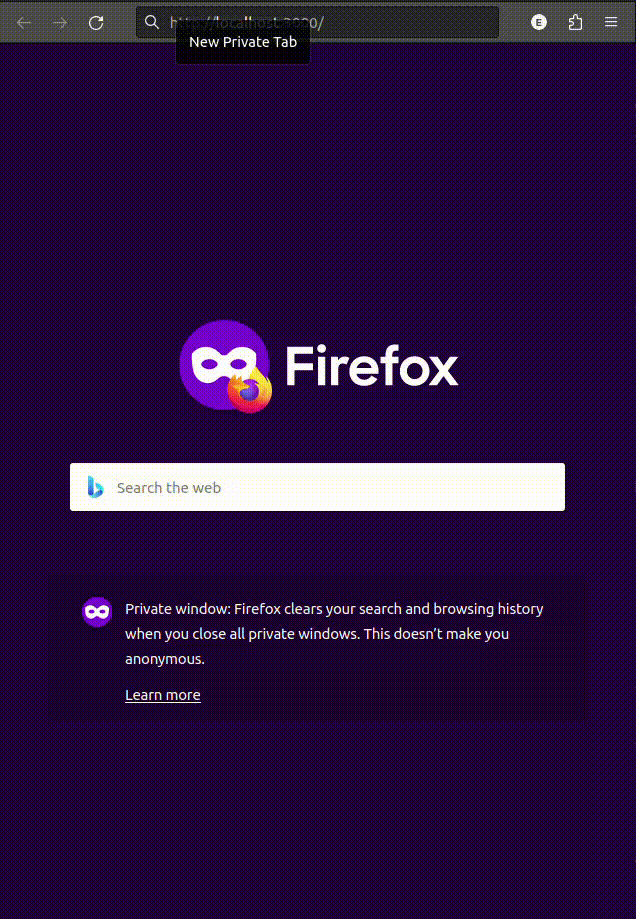

# DreamFest

Dreamfest is a music festival schedule managing app.
This was my first app using full-stack with knex.

## Setup

### Installation and migrations

- [ ] Install packages, run migrations and seeds, and start the dev server with `npm run dev`

  ```
  npm install
  npm run knex migrate:latest
  npm run knex seed:run
  npm run dev
  ```

  This will create and populate the database with the existing migrations and seeds, and start the server.

### Demo

